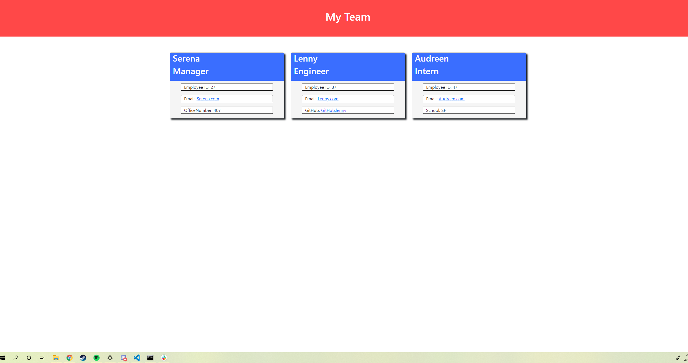

# teamprofilegenerator

## Languages used
javascript was used to construct the website 
HTML was used to contruct a template for the website
CSS was used for basic styling of the HTML

## Summary of the Project
An application that runs in Node, it takes in user input and returns an HTML page that contains all the user input in the form of multiple employees.

## Application Preview


## code snippet (Starting Function)
```
  function addManager() {
        inquirer
        .prompt([
            {
                type: "input",
                message: "what is the manager's name?",
                name: "managerName"
            },
            {
                type: "input",
                message: "what is the manager's ID?",
                name: "managerID"
            },
            {
                type: "input",
                message: "what is the manager's email address?",
                name: "managerEmail"
            },
            {
                type: "input",
                message: "what is the manager's Office Number?",
                name: "managerOffice"
            },

        ])
        .then(function (data) {
            const name = data.managerName
            const id = data.managerID
            const email = data.managerEmail
            const officeNumber = data.managerOffice 
            const manager = new Manager(name, id, email, officeNumber)
            team.push(manager)
            addEmployee()
        })};
```

## Links

[GitHub](https://github.com/SerenaChandler)

[repo](https://github.com/SerenaChandler/teamprofilegenerator)

[Video-Walkthrough]()